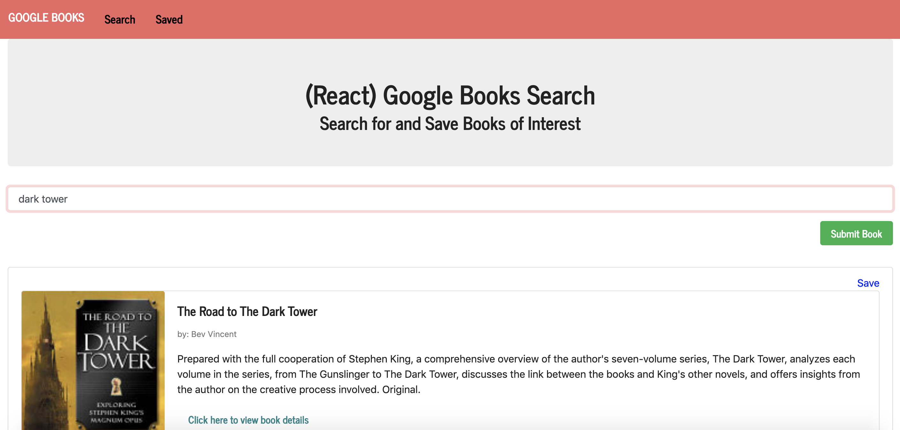

# Google Books Search
## User Story
As an individual who loves to read

I want to be able to search for different titles that interest me and save them to a reading list

So that I can reference this list and delete the books as they are read 

## Description and Usage
*Search Tab*

In the Search bar, type the title of a book you are interested in reading and click the 'Submit Book' button. A list of books with the specified title or similar title will appear with the following information:

* Image of the book
* Title
* Author(s)
* Synopsis
* Clickable link to view additional information about that book

 
Click the 'Save' button next to the book in which you would like to save to your personalized reading list.

*Saved Tab*

Click on the 'Save' link at the top of the page to view your reading list. Click the 'Delete' button next to each book that you have either read or are no longer interested in reading to remove that book from your list. Happy reading!

[Click here to create your own reading list!](https://ashleyw27.github.io/code_quiz/)

## Technology
* *M*ongoDB
* *E*xpress
* *R*eact
* *N*ode
  
## What I Learned
I learned many new concepts and skills while creating this Google books search. A few of which include:
* How to create an application utilizing the entire MERN stack
* How to use React hooks
* How to use React router
